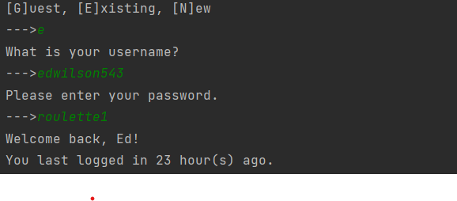
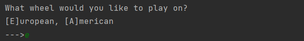
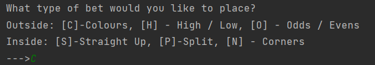
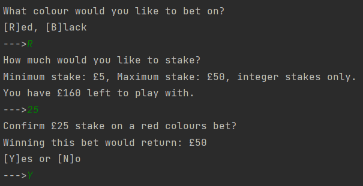
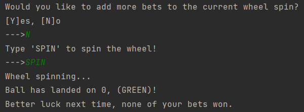
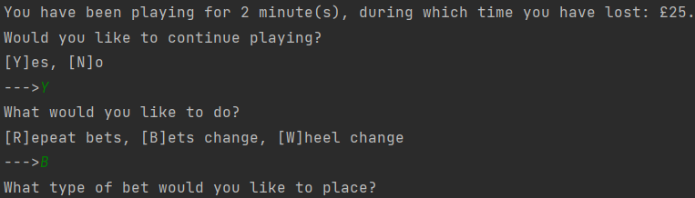

<h1> Casino </h1>

Balint and Ed's online casino

<h4>
    This repository is a Roulette application with a command line user interface, designed to be extendable into a full
    suite of casino games.
</h4>

<h3>Authors and acknowledgement:</h3>

    <b>
        <a href="https://github.com/edwilson543">Ed Wilson</a>
    </b>
 
    <b>
        <a href="https://github.com/szepfalvibalint">Balint Szepfalvi</a>
    </b> 

<h3>Setup and gameplay:</h3>

    <b>1)</b> Clone the repository 
    <b>2)</b> Create a virtual environment 
    <b>3)</b> Install the application dependencies from the requirements.txt file 
    <b>4)</b> Run the play_roulette_command_line.py module in /play_games

<h3>UI screenshots and gameplay:</h3>
The game has a simple command line user interface, which is easy to use and demonstrates the core game flow implemented.
 

<b>Game initiation and playing mode:</b> 

When the game starts the welcome message above is displayed. Users have three options in terms of entry into the game: 
    1) Play as a guest, in which case their session is stand-alone and will not be saved.  
    2) Play as an existing player (i.e. login). In this case the user has previously made an account and uses their
        username/password. Player data is stored in a JSON database, see notable/interesting features below for details. 
    3) Play as a new player - the user is directed to make an account (set name, username password etc.). Their
        data is then uploaded to the database and they play in effect as an existing player. 
All 3 selections result in the instantiation of a PlayerUser object using their own / guest parameters.

<b>Existing player login:</b> 

If playing as an existing player, the user enters their username and password as shown. A last active session end time 
parameter is stored for each player, which is compared with the current time to create
the last login message shown. There are small sub-branches of the game that may be triggered at this point. For example,
if the player is low on funds, they may receive a top up prompt and if accepting of this prompt be guided to make a top 
up.

<b>Wheel selection:</b> 

The user is given a choice of wheels to play on which have slightly different slots. The game has been implemented in 
such a way that it's quick and easy to add more wheels to the game, of arbitrary user definition. The wheel is then in
place for the game loop, however can be changed at the end of each betting round (see below). Note that the application
is intentionally not case sensitive, hence the use of a lower case e in the image (passwords, however, are case
sensitive...).

<b>Bet selection:</b> 

Different inside and outside bet options are displayed to the user, who is guided to pick the bet type they would like 
to place. Again, the game has been implemented such that it's very easy to add new bets of arbitrary definition.

<b>Bet placement:</b> 

The user must then enter the parameters specific to their initial bet type choice.
Each bet type has its own class in both the backend (e.g. ColoursBet) and also for the command line user interface (e.g. 
ColoursBetUser, which subclasses both ColoursBet and RouletteBetUser). Here ColoursBet implements the abstract methods
of RouletteBet, used to define logic specific to this bet such as what the valid bet choices are.
Meanwhile, ColoursBetUser implements the abstract methods of RouletteBetUser, which are used to display bet specific
messages on the command line and prompt user input.

<b>Bet evaluation:</b> 

The user is given the option of adding more bets to the current wheel spin (always subject to criteria such as having
sufficient funds available to meet the minimum-minimum bet - if these criteria fail, then this option will be bypassed and the
user will be taken straight to spinning). The player then types 'spin/SPIN' etc., which initiates a random selection of
a spin outcome from the game wheel's slots (which are stored as a dictionary with slot numbers as keys and colours as 
values.
The spin outcome is compared with the user's bet selection - internally, whatever type of bet the user has made, their
selection is converted into a list of integers representing the slots of the wheel that would result in them winning the
bet. If the user has multiple active bets on the current spin, each of these are evaluated individually using the same
spin outcome. Note that the spinning of the wheel is intentionally delayed in the actual game play (using the sleep 
function) so that the spin outcome doesn't just come up immediately.

<b>Game continuation and looping:</b> 

After each spin, a message is displayed with the player's winnings/losings in the current active session.
The player can decide to keep playing or exit - in the event of an exit, their updated data will be
uploaded to the JSON player database. In order to continue playing, as at login, the player must meet certain criteria
such as having sufficient funds to do so, otherwise a top up prompt is shown. 
The options at the bottom of the image show how the user has control over where to re-enter the game loop - they can 
either: 
1) Repeat their bets (carry out a quick re-spin of the wheel with the given bet selections) - this option is only 
displayed if the total stake of the previous bets exceeds their new remaining pot. 
2) Change their bets - sticking with the same wheel choice, the user can pick new bet types and selections within these
bets. 
3) Change the wheel - the takes the user to the very start of the game loop, the stage which immediately follows the 
login step.

Note that the entire game flow has been carefully constructed to ensure that no nonsensical cases can be entered - for 
example the player having a negative pot.

<h3>Notable or potentially interesting features of the repository:</h3>

<b>Object-oriented approach giving a clear structure and allowing scalability:</b>
The core objects in a Roulette game (Bets, Players, Wheel and Table)
are all implemented as their own classes. These objects make it very straightforward to define new wheels for
the Roulette application and add new bet types with their own logic, as well as paving the way for an application with
more games.
 

<b>JSON Player Database:</b> 
The application includes a dynamic database for locally storing player data, allowing players to create an account with
a username and password, store their betting pots, and allow the application to track their log-in times. 
This is implemented using JSON (JavaScript Object Notation) - Player object attributes are serialised into a form that 
can be stored as JSON, and the player database is stored as a single JSON dictionary, with the player usernames as keys. 
Player is data  retrieved from the database in JSON, deserialised and used to instantiate a Player object. 
A class to manage this database was implemented, with common database features such as data creation, updating,
retrieval and deletion. 
The database manager is visible in the repository however a database is not - this is because it is gitignored and
automatically populates locally the first time a user creates an account.
 

<b>Unit and integration testing:</b> The application includes over a hundred unit tests as well as integration tests of 
the core game functionality.
This includes testing of the command line UI - this was a challenge in that the UI takes a user 
input to proceed, and as such any test must simulate user input on the command line. To this end, a utility function
was defined which takes a sequence of inputs and returns the nth item in this sequence at the nth call. The input 
function can then be over-ridden with the utility function using pytest's monkeypatch. The utility function is
implemented as a generator, yielding the nth value in the sequence on the nth call using the built-in next() function.
 

<b>Clear separation of the backend and command line UI:</b> The code is separated out such that the backend logic of the
Roulette game and the command line user interface are distinct. As such, it would be possible to add a GUI on top of the
existing backend code without having to change any existing code.
 

<h3>Ideas for future extension:</h3>

<b>Add a GUI.</b>
Fairly obvious extension - some sort of graphical user interface to bring the game to life. Could be a simple desktop
app implemented in Tkinter or PyQT, or a web application.
 

<b>Allow multiplayer functionality.</b>
Following on from the GUI point above, a web application would give the opportunity to have multiple players
betting on the same spin of the Roulette wheel, and using a framework such as Django would make it easier to implement
a more sophisticated authentication and database management system.
 

<b>Add more games beyond just Roulette.</b>
The code is intended to be re-usable for other casino games. In particular objects such as the Player and the Bet.
This could also tie-in well with making the application multiplayer, implementing games such as blackjack and poker.
 

<b>Add strategy simulation</b>
An interesting extension would be to implement a way in which users can simulate different betting strategies and 
receive a summary of how this strategy performed - for example the 'Martingale strategy', where players double their
stake following a losing evens bet, and stake say £1 following a winning evens bet. However, Roulette is essentially a
random walk with a negative expected value at each step, making it a classic Gambler's ruin situation. This put me off
going down the strategy simulation route, as with a properly defined Roulette game which includes maximum stakes, the
only outcome of such an analysis would be to determine the strategy that allows players to prolong ruin the longest,
which is perhaps not that interesting. The desire to implement a game with a genuine strategic element was a core reason
for undertaking the 
<a href="https://github.com/edwilson543/noughts_and_crosses"> Noughts and Crosses project.</a>
 

<b>Add encryption for player passwords.</b>
This could be achieved at the point at which players are serialised into JSON and
put in the database, with decryption happening when players are retrieved from the database.
 

