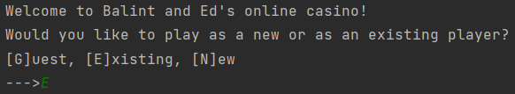

<h1> Casino </h1>

Balint and Ed's online casino

<h4>
    This repository is a Roulette application with a command line user interface, designed to be readily extendable into
    a full suite of casino games.
</h4>

<h3>Authors and acknowledgement:</h3>

    <b>
        <a href="https://github.com/edwilson543">Ed Wilson</a>
    </b>
 
    <b>
        <a href="https://github.com/szepfalvibalint">Balint Szepfalvi</a>
    </b> 

<h3>Setup and gameplay:</h3>

    <b>1)</b> Clone the repository 
    <b>2)</b> Create a virtual environment 
    <b>3)</b> Install the application dependencies from the requirements.txt file 
    <b>4)</b> Run the play_roulette_command_line.py module in /play_games

<h3>UI screenshots</h3>
The game has a simple command line user interface, which is easy to use and demonstrates the core game flow implemented.

<b>Game initiation and playing mode:</b>

Upon running the game

<h3>Notable or potentially interesting features of the repository:</h3>

<b>Object-oriented approach giving a clear structure and allowing scalability:</b>
The core objects in a Roulette game (Bets, Players, Wheel and Table)
are all implemented as their own classes. These objects make it very straightforward to define new wheels for
the Roulette application and add new bet types with their own logic, as well as paving the way for an application with
more games.
 

<b>JSON Player Database:</b> 
The application includes a dynamic database for locally storing player data, allowing players to create an account with
a username and password, store their betting pots, and allow the application to track their log-in times. 
This is implemented using JSON (JavaScript Object Notation) - Player object attributes are serialised into a form that 
can be stored as JSON, and the player database is stored as a single JSON dictionary, with the player usernames as keys. 
Players can then be retrieved from the database in JSON, deserialised and instantiated as Player objects.  
A class was created to manage this database, including common database features such as data creation, updating,
retrieval and deletion. 
The database manager is visible in the repository however a database is not - this is because it is gitignored, and
automatically populates locally the first time a user creates an account when playing Roulette.
 

<b>Unit and integration testing:</b> The application includes over a hundred unit tests and integration tests as well.
This includes testing of the command line application - this was a challenge in that the command line takes a user 
input to proceed, and as such any test must simulate user input on the command line. To this end, a utility function
was defined which takes a sequence of inputs and returns the nth item in this sequence at the nth call, and overrides
the input function using pytest's monkeypatch. The utility function was implemented as a generator, yielding the nth
value in the sequence on the nth call using the built-in next() function.
 

<b>Clear separation of the backend and command line UI:</b> The code is separated out such that the backend logic of the
Roulette game and the command line user interface are distinct. As such, it would be possible to add a GUI on top of the
existing backend code without having to change any existing code.
 

<h3>Ideas for future extension:</h3>

Add encryption for player passwords. This could be achieved at the point at which players are serialised into JSON and
put in the database, with decryption happening when players are retrieved from the database.
 

